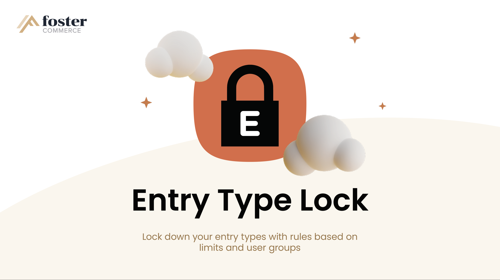
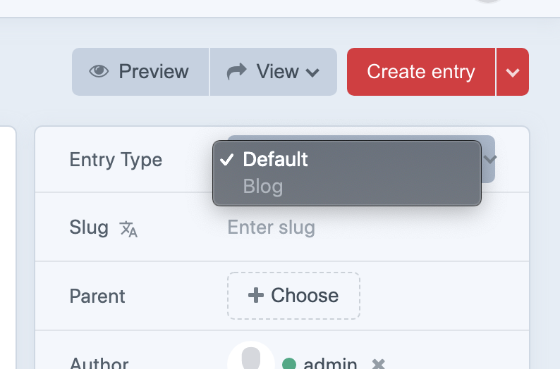
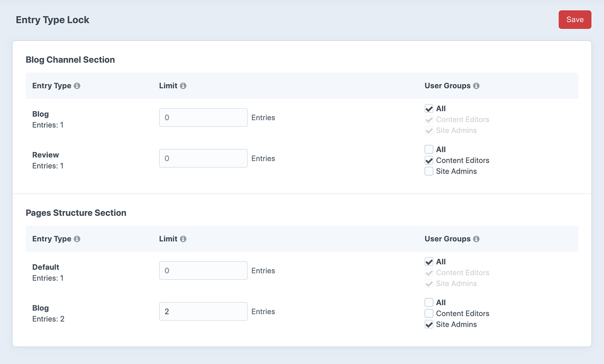
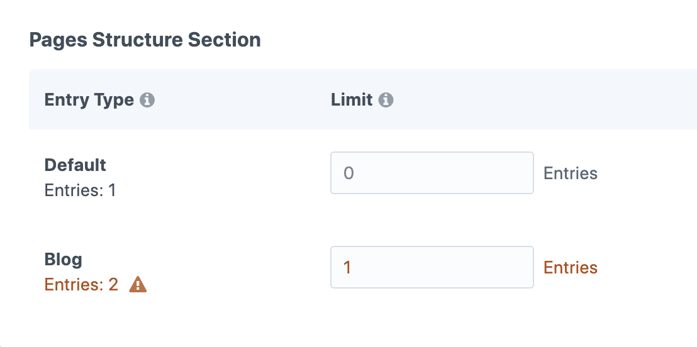

# Entry Type Rules plugin for Craft CMS 3.7.x



A Craft plugin that allows you to set rules on number of entry types in a Craft section and/or limit who can include
entry type entries based on their user group.

## Requirements

This plugin requires Craft CMS 3.7.x or later.

## Installation

To install the plugin, follow these instructions.

1. Open your terminal and go to your Craft project:

        cd /path/to/project

2. Then tell Composer to load the plugin:

        composer require FosterCommerce/entry-type-rules

3. In the Control Panel, go to Settings → Plugins and click the “Install” button for Entry Type Rules.

## Entry Type Rules Overview

Entry Type Rules will allow you to restrict entry types in sections based on a count limit and/or
user group. This can be useful when taking advantage of entry types for example in a structure
section, where you could have a "Contact" entry type that you only want one of within a "Pages"
structure section, or a "Blog Landing Page" entry type you would only like to allow certain users
to be able to create.



For example, if an entry type in a section has a count limit set, and the number of entries for that
entry type has been reached, when creating a new entry, the Entry Type selector field will have that
entry type disabled. Likewise, if an entry type has been restricted to allow for only certain user groups
to create new ones, and the current user is not in those user groups, the entry type option will also be
disabled for that entry type.

## Configuring Entry Type Rules

Entry Type Rules can be configured from its Settings page in the control panel or, by using a config
file which will override the plugins settings from those set in the control panel settings page.

### Configure in the Control Panel Settings Page

In the Control Panel, go to Settings → Entry Type Rules. The control panel settings page lists out all of your structure
and channel sections, and their entry types. For each entry type you can place a numerical limit on the number of
entries, and/or select the users groups which can create new entries of the entry type.



#### Limit Fields

The limit field allows you to set an entry limit for the entry type. Once the number of entries has reached that
limit, the entry types option will be disabled in the entry edit form. If you set the limit to a number below the
current number of entries of that entry type, a warning will be displayed.
*NOTE: The setting will still be saved regardless of the warning, its just there to inform you.*



#### User Groups Fields

The user groups field allows you to select the user groups that can create new entries of the entry type. If a user
is not in any of the specified groups, the entry types option will be disabled in the entry edit form.
*NOTE: Admin users are never restricted from adding entries*

### Configure using a Config File

To configure the plugin via a config file:
1. Copy the ``config.php`` file from the ``vendor/fostercommerce/entry-type-rules`` directory to Craft's
``config/`` directory
2. Rename it to ``entry-type-rules.php``
3. Edit the ``sections`` array in that file to set the sections, entry types, limits, and user groups settings.

```php
<?php

return [
    'sections' => [
        
        // Ex. A 'Pages' structure section handle we want to set rules for entry types in it
        'pages' => [

            // Ex. A 'Contact Page' entry type handle with rules set to limit it to 1 entry
            'contactPage' => [
                'limit' => 1,
            ],

            // Ex. A 'Blog Landing' entry type handle with rules set to limit it to 1 entry,
            // and only allow the 'Site Admins' user group to create new ones
            'blogLanding' => [
                'limit' => 1,
                'userGroups' => ['siteAdmins']
            ],

        ],
        
        // Ex. A 'Blog' channel section handle we want to set rules for entry types in it
        'blog' => [
        
            // Ex. A 'Press Releases' entry type handle with rules to only allow the 'Content Editors'
            // and 'Content Providers' user groups to create new ones for
            'pressRelease' => [
                'userGroups' => [
                    'contentEditors',
                    'contentProviders',
                ]
            ],

        ]
      
    ]
];
```

1. In the ``sections`` array you include the section *handles* for each section you want to create rules for its entry types.
2. Within those sections you include the entry type *handles* for each entry type you want to create rules for.
3. Within the entry types you can then include their rules:
    * ``limit`` - A numeric limit for the number of entries of that entry type
    * ``userGroups`` - An array of user group handles to limit who can create new entries of that entry type

## Entry Type Rules Roadmap

The following is a list of additional features we are working on to incorporate into Entry Type Lock:

* Compatibility with Craft 4
* Ability to configure rules for entry types in sections based on different sites in a Craft multi-site setup
* Provide front end methods to implement rules when entries are submitted from Craft Entry Forms

## Credits

Brought to you by [Foster Commerce](https://fostercommerce.com)
